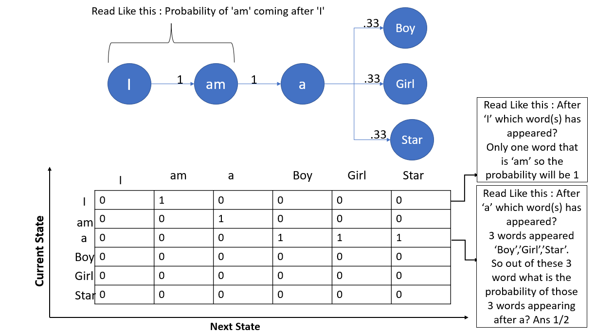
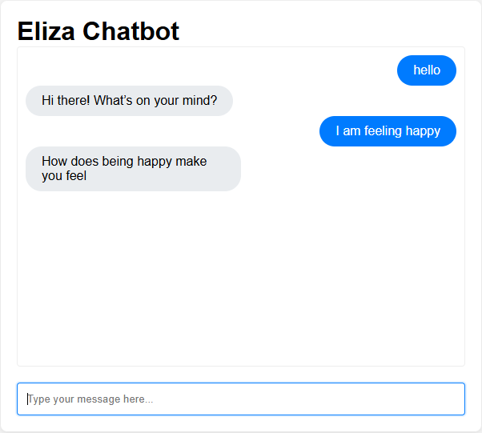

# Emerging Technologies Assessment Repository

**Author:** Adam Amusa (G00400197@atu.ie)

##  Overview

**This repository contains two main Components:**<br>

**Trigrams Notebook (`trigrams.ipynb`)**<br>
The trigrams notebook is a Third Order Approximation Model that gathers [trigrams](https://en.wikipedia.org/wiki/Trigram) from an English text. It calculates the number of times the trigrams appear in the English text along with their frequency of appearance in a dictionary as key-value pairs. The created Trigram Model is then used to attempt to generate English text. The process in which it does so is based on [Natural Language Generation](https://onlinelibrary.wiley.com/doi/book/10.1002/9781444324044#page=590) which is centered around teaching computers to generate human language based on given data such as the English Literature provided, To achieve this we must structure the data in a way in which computers can understand. Therefore we use the values from the trigram model as weights to influence the likelihood of words that appear in a random word generation.

**Eliza Chatbot (`/eliza`)**<br>
This application is heavily inspired by the application called [Eliza](https://web.njit.edu/~ronkowit/eliza.html) which was developed by in 1966 by an MIT profesor named [Joseph Weizenbaum](https://en.wikipedia.org/wiki/Joseph_Weizenbaum) to be used as a psychotherapist.
The Eliza web application is an interactive therapy bot that receives user input and maps the corresponding response from a dictionary of responses then utilises [Javascript's regular expressions](https://developer.mozilla.org/en-US/docs/Web/JavaScript/Guide/Regular_expressions) to capture parts of the user input to add to the response to naturalise the conversation between the user and the Chatbot.


##  Getting Started

### Prerequisites
1. [Python](https://www.python.org/downloads/) installed
2. Jupyter Notebook Installed


### Repository Setup
1. Clone the repository
   ```bash
   git clone https://github.com/AdamAmusa/EmergingTech
   cd EmergingTech
   ```

##  Installation

### Python and Jupyter Notebook

#### Using pip
```bash
pip install notebook
```

#### Using Conda
```bash
conda install -c conda-forge notebook
```

### Eliza Component
You don't need to do any additional installation. The project uses standard web technologies.


## Trigrams Notebook (`trigrams.ipynb`)

###  Usage


#### Method 1: Jupyter Notebook
1. Open the notebook
   ```bash
   jupyter notebook trigrams.ipynb
   ```

#### Method 2: Visual Studio Code
1. Navigate to the project directory
   ```bash
   cd path/to/your/project
   code .
   ```
2. Open `trigrams.ipynb`

**Important:** Execute cells in sequential order

#### Expected Outputs
- Dictionary of trigrams
- Percentage of trigram words that are real English words

   ### How trigrams.ipynb Works
   1. Reads text from an English literature
   2. Splice all the text into segments of three characters, known as trigrams.
   3. Enumerate the number of times each segment appears in the text.
   4. Return a dictionary whose keys are the trigrams and whose value is the number of times the trigrams appear in the text.
   5. Store and output a sequence of randomly generated characters using the trigrams and their values as their weight.
   6. Compare the sequence of characters with real English words and determine the English percentage.

   <br>
   
   <br>

## Eliza Chatbot (`/eliza`)

###  Usage


1. Navigate to https://adamamusa.github.io/EmergingTech/eliza/
2. Interact with the chatbot by entering text inputs.
<div style="float: left; margin-right: 10px;">
    
</div>

<div style="clear: both;"></div>

   ### How Eliza Works
   1. If the user input matches the response pattern.
   2. Get the regex match (Word difference) (r "I am (.*)" user input: "I am happy" regex match: "happy")
   3. System randomly selects a response from a list of patterns.
   4. Analyse the user input and validate any words corresponding to the list of reflections.
   5. Return a response with the reflection word or return just the response.


##  Dependencies

Both components use standard libraries:
- Trigrams Notebook: Python standard library
- Eliza: Standard web technologies (HTML, JavaScript, CSS)

##  Notes
- Ensure you have a modern web browser for the Eliza component
- Python 3.x recommended for the Trigrams Notebook

## Resources
#### Eliza and trigrams solutions were enhanced from and inspired by https://github.com/ianmcloughlin/2425_emerging_technologies
